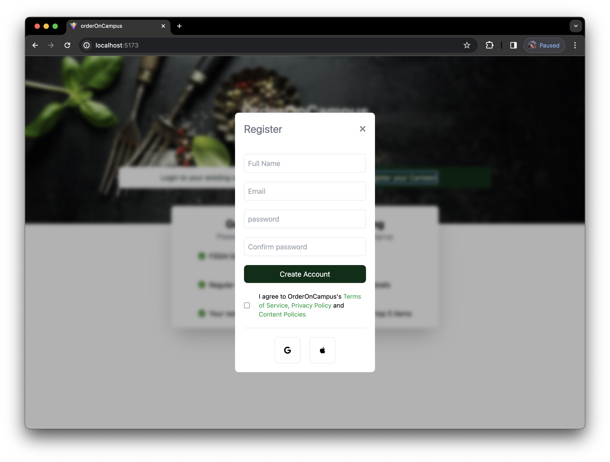

# Full Stack Food Ordering App

This project is a comprehensive solution for both customers and restaurants, providing a seamless experience for food ordering and management. It consists of two main components:

## Client App

The client app is designed for customers to easily browse, order, and pay for food from their favorite restaurants. Users can explore a variety of restaurants, view their menus, place orders, and track the status of their orders in real-time. Features of the client app include:

- User authentication and registration
- Browse restaurants and view their menus
- Place orders with customizations and special instructions
- Real-time order tracking and status updates
- Secure payment processing using Stripe integration
- Order history and reordering functionality
- User profile management and settings

## Restaurant Dashboard

The restaurant dashboard is a powerful tool for restaurant owners and staff to manage their orders, menu items, and business operations efficiently. It provides insights into order analytics, helps streamline order fulfillment, and enables easy menu management. Key features of the restaurant dashboard include:

- Secure login for restaurant owners and staff
- Dashboard overview with order statistics and analytics
- Order management interface for accepting, preparing, and completing orders
- Menu management tools for adding, updating, and removing items
- Inventory management to track ingredient availability
- Notification system for new orders and updates
- Integration with Stripe for secure payment processing and payouts
- Settings and configuration options for restaurant profiles

## Technologies Used

- **Frontend**: React Native for the client app, React for the restaurant dashboard
- **Backend**: Node.js with Express for the server-side API
- **Database**: MongoDB for storing restaurant and user data
- **Payment Integration**: Stripe API for secure payment processing
- **State Management**: Redux for managing application state
- **Authentication**: JSON Web Tokens (JWT) for user authentication and authorization

This full-stack food ordering app provides a user-friendly interface for customers and efficient management tools for restaurant owners, enhancing the overall experience of food ordering and delivery.

## Screenshots

To provide a visual representation of the app's functionality and design, you can find screenshots of both the client app and the restaurant dashboard below:

### Client App Screenshots


### Restaurant Dashboard Screenshots





These screenshots showcase the user interface and features of the app, providing a glimpse into the user experience for both customers and restaurant owners/staff.

## Installation and Usage

To get started with this project, follow these steps:

1. Open the terminal in your preferred directory.
2. Clone this repository using the following command:
   
   ```bash
   git clone https://github.com/Amarr7777/orderOnCampus-full.git
   # Navigate to the server directory
    cd server

   # Install dependencies
    npm i

   # Start the server
    npm start
   
   # Navigate to the app directory
    cd ../client/orderOnCampus-app

   # Install dependencies
    npm i

   # Start the server
    npm start
   
   # Navigate to the dashboard directory
    cd ../orderOnCampus-canteen

   # Install dependencies
    npm i

   # Start the server
    npm run dev

## Conclusion

With the completion of these installation steps, you're now ready to explore and utilize the full potential of my food ordering application. Whether you're a customer looking for a convenient way to order your favorite dishes or a restaurant owner seeking efficient management tools, my app is tailored to meet your needs.

I'm committed to continually enhancing the app's features and user experience, so stay tuned for updates and improvements. Thank you for choosing my full-stack food ordering app. I hope you enjoy using it as much as I enjoyed creating it.

Feel free to reach out to me with any feedback or inquiries. 
- Email: [amarpradeep0805@gmail.com](mailto:amarpradeep0805@gmail.com)
- LinkedIn: [Amar G Nath](https://www.linkedin.com/in/amargnath)

Happy ordering!